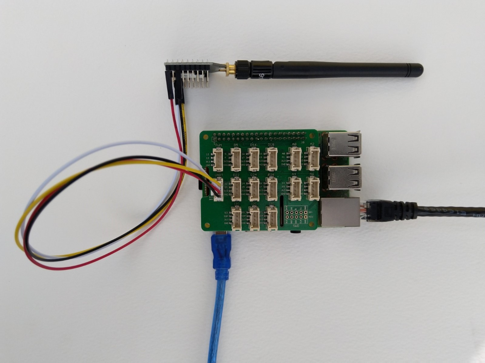
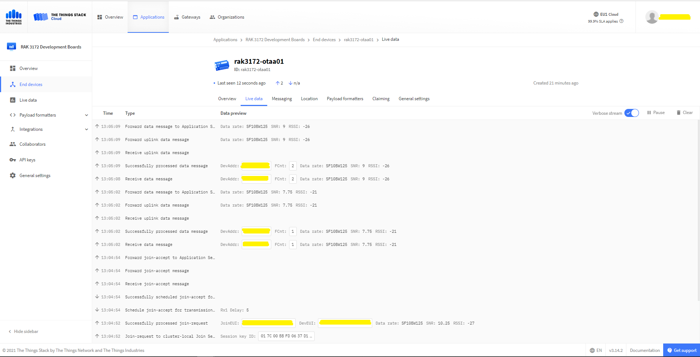

# RAK3172LoRaWAN-NetCore
C# RAK3172 LoRaWAN library for .Net Core powered devices
A C# library for [LoRaWAN](https://lora-alliance.org/about-lorawan) connectivity for [RAKwireless](https://www.rakwireless.com/en-us) [RAK3172 Module](https://www.rakwireless.com/en-us/products/lpwan-modules/rak3172-wisduo-lpwan-module) equipped [.Net Core 5](https://dotnet.microsoft.com/) powered devices.

This repo has the source code for the series of blog posts written as developed the library

01. [Basic connectivity](http://blog.devmobile.co.nz/2021/09/19/net-core-rak3172-lorawan-library-part1/)
02. [Nasty OTAA connect](http://blog.devmobile.co.nz/2021/09/20/net-core-rak3172-lorawan-library-part2/)

I used a [Grove Base HAT for Raspberry Pi](https://www.seeedstudio.com/Grove-Base-Hat-for-Raspberry-Pi.html) and [RAK3172 Breakout](https://store.rakwireless.com/products/wisduo-breakout-board-rak3272s) for development

[The Things Network](https://www.thethingsnetwork.org/) uplink and downlink messaging 

I used a local [RAK7258 WisGate Edge Lite](https://store.rakwireless.com/collections/wisgate-edge/products/rak7258-micro-gateway) connected to [The Things Network](https://www.thethingsnetwork.org/) to test my implementation.
